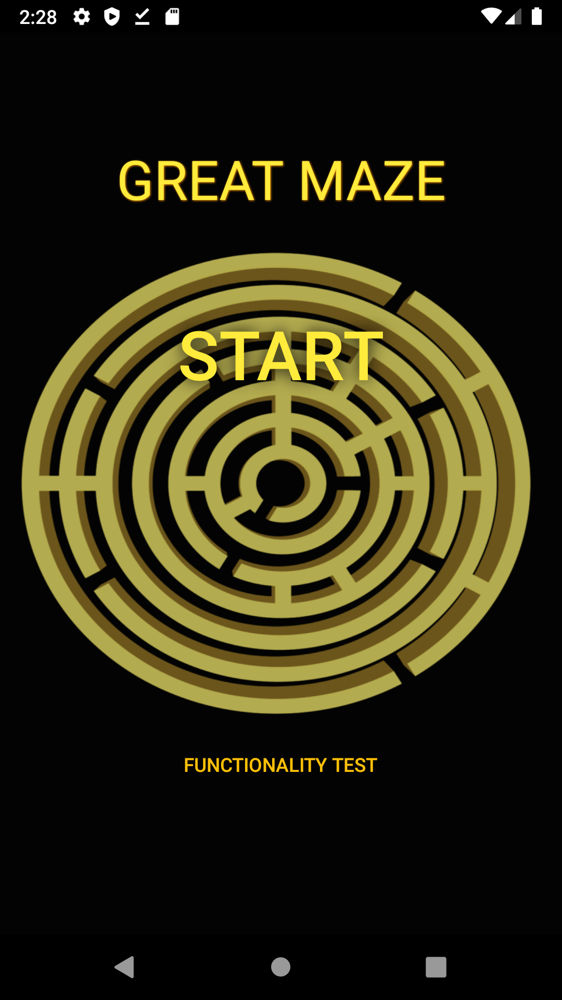
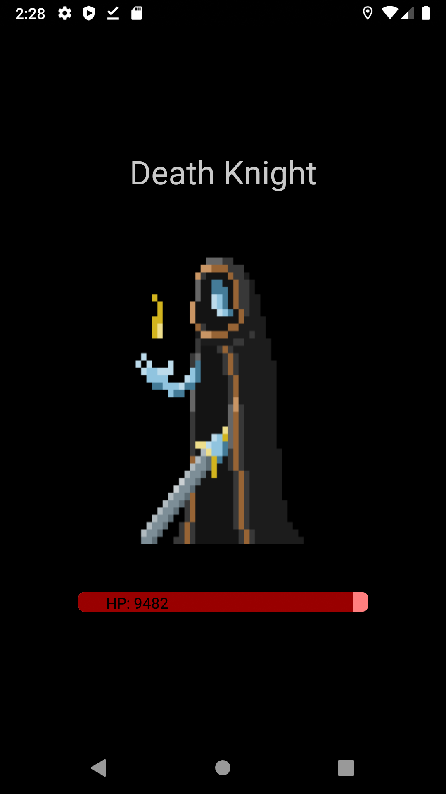
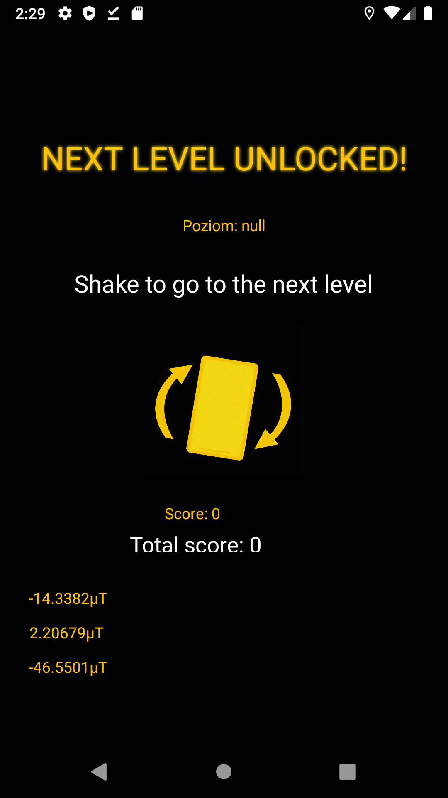
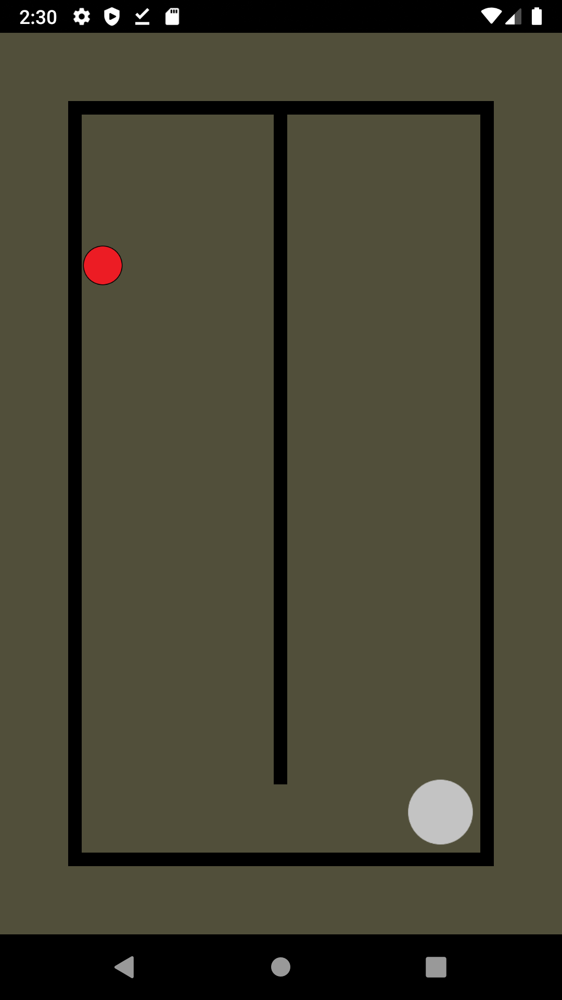

# The Great Maze app
Mobile game that allows player to defeat enemies, explore ancient mazes and discover new worlds.

## Technologies
* Java
* Android studio with gradle
## Used sensors
* GPS sensor - localisation
* Gryoscope, accelerometer - moving ball
* Light sensor - color temperature change

## Requirements 
* Android 28 API+

## Screenshots
               
             
